class: center, middle, section

## A primer on Mixed-Effects Models:<br>Theory and practice

Gonzalo García-Castro

[](https://github.com/gongcastro)
[](https://twitter.com/gongcastro)

<br><br>

25th March 2020

---
class: center, middle, section

```{r setup, include=FALSE}
options(htmltools.dir.version = FALSE, knitr.kable.NA = '-')
knitr::opts_chunk$set(
  fig.height = 6,
  out.width = "100%"
)
knitr::opts_chunk$set(fig.height=6, out.width="100%")

```


```{r prepare, message=FALSE, warning=FALSE, include=FALSE, paged.print=FALSE}
# load packages
library(dplyr)
library(tidyr)
library(ggplot2)
library(knitr)
library(tibble)
library(truncnorm)
library(purrr)
library(latex2exp)
library(here)
library(lme4)
library(patchwork)

set.seed(888) # for reproducibility
theme_set(  
  theme(
    panel.grid = element_blank(),
    panel.grid.major.y = element_line(linetype = "dotted", colour = "grey10"),
    panel.background = element_rect(fill = "transparent"),
    panel.border = element_rect(fill = "transparent", colour = "grey"),
    text = element_text(size = 20, family = "Helvetica"),
    axis.line = element_line(colour = "black"),
    axis.text = element_text (colour = "black", family = "Helvetica")
  )
)
```

# First of all...

---
# Disclaimer

I'm not a trained statistician

Don't trust me (too much)

Mistakes may (will) be made

I'm not 100% sure about anything

Probably, none of us will ever be


So let's get to it!

.pull-right-normal[

]

???

Sometimes we need to get fancy to get the most out of out (little and precious) data

---
# Notation

.centered[Linear Mixed-Effects Models = LMM]

**Mixed Models** (aka. Mixed-Effects Models, aka. Multilevel Models, aka. Hierarchical Models, aka. Nested Data Models, aka. Random Parameter Models, aka. Split-Plot Designs)

<br>

If by the end of this presentation you have an intuition about why all **these labels refer to the same thing**

Yay! You have made so much progress.

---
## Disclaimer (bonus 1)

We need to learn a bit about programming.

```{r echo=FALSE, message=FALSE, warning=FALSE, out.width="40%", paged.print=FALSE}

```

---
## Disclaimer (bonus 2)

Most statistical literature on LMM uses **R** (e.g., `lmer()` function of the `lme4` package)

```{r echo=FALSE, message=FALSE, warning=FALSE, paged.print=FALSE, out.width="40%"}
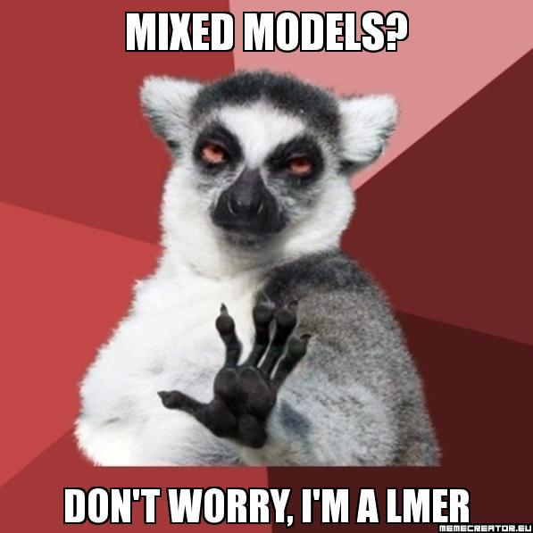
```

---
## Disclaimer (bonus 2)

Many other programming languages support LMM

* Python: `statsmodels` library, `Pymer4`
* Matlab: `Statistics and Machine Learning Toolbox`
* Julia: `MixedModels`
* Stan: `Bayesian modelling`, with interfaces with R, Python and Matlab)

I don't assume you are familiar with R, but I will use some R code for illustration purposes.

---
class: section, center, middle

# Materials

Some recommended reads.

---
### Materials: Books and book chapters

.small[
Navarro, D. J. (2015). Learning statistics with r: A tutorial for psychology students and other beginners.

Field, A., Miles, J., & Field, Z. (2012). 19. Multilevel linear models. In Discovering statistics using r. SAGE Publications.

Winter, B. (2019). Statistics for linguists: An introduction using R. Routledge.

Mirman, D. (2016). 4. Structuring random effects. In Growth curve analysis and visualisation using r. CRC press.

Gelman, A., & Hill, J. (2006). Data analysis using regression and multilevel/hierarchical models. Cambridge University press.

Fox, J., & Weisberg, S. (2018). An r companion to applied regression. SAGE publications.

McElreath, R. (2020). Statistical rethinking: A bayesian course with examples in r and stan. CRC press.
]

---

### Materials: Articles

.small[
Winter, B. (2013). Linear models and linear mixed effects models in R with linguistic applications. arXiv Preprint arXiv:1308.5499. https://arxiv.org/abs/1308.5499

DeBruine, L., & Barr, D. J. (2019). Understanding mixed effects models through data simulation. https://doi.org/10.31234/osf.io/xp5cy

Barr, D. J., Levy, R., Scheepers, C., & Tily, H. J. (2013). Random effects structure for confirmatory hypothesis testing: Keep it maximal. Journal of Memory and Language, 68(3), 255–278.

Barr, D. J. (2013). Random effects structure for testing interactions in linear mixed-effects models. Frontiers in Psychology, 4, 328. https://www.frontiersin.org/articles/10.3389/fpsyg.2013.00328/full

Bates, D., Kliegl, R., Vasishth, S., & Baayen, H. (2015a). Parsimonious mixed models. arXiv Preprint arXiv:1506.04967. https://arxiv.org/pdf/1506.04967.pdf

Baayen, R. H., Davidson, D. J., & Bates, D. M. (2008). Mixed-effects modeling with crossed random effects for subjects and items. Journal of Memory and Language, 59(4), 390–412. https://doi.org/10.1016/j.jml.2007.12.005

Barr, D. J. (2008). Analyzing “visual world” eyetracking data using multilevel logistic regression. Journal of Memory and Language, 59(4), 457–474. https://doi.org/10.1016/j.jml.2007.09.002

]

---

### Materials: Articles (special mentions)

.small[
Meteyard, L., & Davies, R. A. (2020). Best practice guidance for linear mixed-effects models in psychological science. Journal of Memory and Language, 112, 104092. https://doi.org/10.1016/j.jml.2020.104092

Bates, D., Mächler, M., Bolker, B., & Walker, S. (2015b). Fitting linear mixed-effects models using lme4. Journal of Statistial Software, 67(1). https://doi.org/10.18637/jss.v067.i01
]

---
class: section, middle, center

# Modelling

A reminder.


---
## Modelling: What for?

To estimate a **parameter** that characterises a population using data from samples of that population.

This unknown **parameter** can be whatever we want:

* Central tendency measures (e.g., mean, median)
* Dispersion measures (e.g., standard deviation)
* Measures of association between variables (e.g., coefficients)

We usually estimate all of them when analysing data and perform some kind of **statistical inference** from them.


---
## Modelling: What for?

In confirmatory analyses, we:

1) Hypothesise that the parameter is within a range of values

2) Collect data

3) Perform statistical inference

<br>

* **Frequentist approach**: what is the probability of our data, assuming our hypothesis is true?
* **Bayesian approach**: what is the probability of our hypothesis, given the data?

---
## Modelling: What for?

In experimental confirmatory research, we are usually interesed in **estimating the association between two or more variables**:

* *Age* (predictor) and *vocabulary size* (outcome)
* *Bilingualism* (predictor) and *novelty preference* (outcome)
* *Native linguistic rythmic class* (predictor) and *entrainment to speech signal* (outcome)

We try draw a shape (e.g., line, curve) that defines this relationship.

For now, we will stick to óne shape: **lines**.

---
## Modelling: What for

The three (four, sometimes) steps of modelling:

1) **Model especification**: what variables am I going to include in the model?

2) **Model fitting**: what line fits data the best?

3) **Statistical inference**: Does my model fit data good enough? What is the contribution of each predictor to the goodness of fit?

4) (Bonus track) **Model validation**: Does my model predict new outcomes correctly?

---
## Modelling: 1) Model especification

We need to define what **outcomes** and **predictors** I am interested in.

> e.g., what am I trying to predict? What variables am I using to predict it?

What are my **assumptions** about how they relate to the outcome?

> e.g., linearity, normality of residuals

What are my assumptions about **how each predictor relates to the other predictors**?+

> e.g., do I expect interactions between predictors?

---
## Modelling: 1) Model especification

We will work with **linear** models

This means that we will try to draw a **line** that defines the relationship between predictors and outcome.

But bear in mind that **non-linear models** exist as well

For instance, we may need/want to fit a **curve** or an **exponential** function

> e.g., Growth Curve Analysis

---
## Modelling: 1) Model especification

Every line is defined by the following equation, named the **General Linear Model (GLM)**:

$$
Y = \beta_0+\beta_j \times X + \varepsilon
$$

Where:

* $Y$ is the value that the outcome variable takes (we know this value)
* $\beta_0$ is the intercept
* $\beta_j$ is the coefficient
* $X_j$ is the value that the predictor $X$ takes (we know this value)
* $\varepsilon$: residual (error the model makes)

---
class: center

## Modelling: 1) Model especification

$$
Y = \beta_0+\beta_1 \times X
$$

This formula underlies most statistical techinques we use normally:

```{r echo=FALSE, message=FALSE, warning=FALSE, paged.print=FALSE, out.width="25%"}

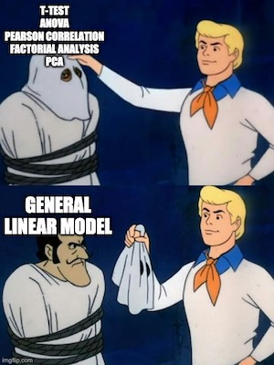

```

---
class: center

## Modelling: 1) Model especification

Most of them are generalised or special cases of the the **GLM**.

.centered[
[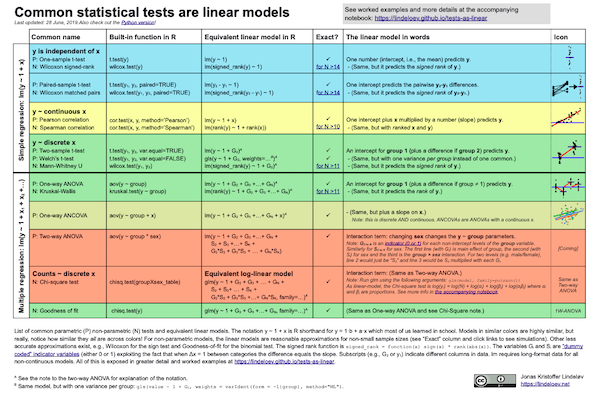](https://lindeloev.github.io/tests-as-linear/)
]

---
## Modelling: 1) Model specification

We can extend the GLM to include more predictors:

$$
Y = \beta_0 + \beta_1 X_1 + \beta_2 X_2 + ... +  \beta_j  X_j
$$

Each coefficient (e.g., $\beta_1$, $\beta_2$) will contribute to the model by "adjusting" the line.

But how much should each coefficient contribute?

We need to take a look at the data.

---
## Modelling: 2) Model fitting

There are infinite lines we can draw with these parameters.

$$
Y = \beta_0 + \beta_1 X_1 + \beta_2 X_2 + ... +  \beta_j \times X_j
$$

We need to find the combination of values of the coefficients $\beta_0$ and $\beta_j$ that make the line fit data the best.

We need to find the **Least Squares Regression Line**

This line **minimises the overall distance between the lines and the data points**

How to find it? We use built-in **algorithms** that try a lot of combinations until finding the optimal one.

---
class: center

## Modelling: 2) Model fitting

Play with regression lines:

https://antoinesoetewey.shinyapps.io/statistics-202/

---
## Modelling: 3) Statistical inference

We have obtained **coefficients** that define the slope and position of the line that fits data the best.

But **"best"** is relative.

Even the best model could be fitting the data very badly

We need to assess how wuch of the variance our model accounts for.

Compute compute some measure of goodness of fit

> e.g., $R^2$: proportion of variance accounted for the model

If the model shows nice fit, let's smove on to **interpret the coefficients**!

---
## Modelling: 3) Statistical inference

We have a bunch of **coefficients**

Each coefficient tells us **how much each predictor contributes to the slope** of the line

All coefficients contribute to some degree. $\beta_j = 0$ is almost impossible.

**What coefficients contribute significantly?**

---
## Modelling: 3) Statistical inference

Imagine that the **true (population) value of coefficient** $\beta_1$ is 0

This means that it has **no predictive value** regarding the outcome variable

How what is the probability of $\beta_1$ taking the value it takes in our sample, **assuming that $\beta_1 = 0$** is true? 

If it is very **unlikely**, we should **reject** the assumption that $\beta_1 = 0$

If its **likely enough**, we **don't reject** the assumption that $\beta_1 = 0$

---
## Modelling: 3) Statistical inference

How can we know the **likelihood of our coefficient**?

We need to map it onto a **probability distribution**.

A probability distribution tells us the probability of each value a variable can take.

Different variables can follow different distributions:

* Gaussian (aka. normal, aka. exponential)
* Student's *t*
* Snedecor's *F*
* Poisson
* ...

---
## Modelling: 3) Statistical inference

We know that **coefficients** in linear models tend to follow a **Gaussian distribution**. This distribution is known.

It tells us the **probability** of each value of our coefficient, **assuming that its true value is 0**.

---
## Modelling: 3) Statistical inference

```{r distribution, warning=FALSE, dev="svg", include=FALSE, out.width="50%"}

dens <- density(rnorm(1000000), bw = 0.2)
data <- tibble(x = dens$x, y = dens$y) %>% 
  mutate(variable = between(x, qnorm(0.025), qnorm(0.975)))

distribution_plot <- ggplot(data, aes(x, y)) +
  geom_line() +
  geom_area(fill = "#C8102E", colour = "#C8102E") +
  geom_area(data = filter(data, variable), fill = "#002147",
            colour = "#002147") +
  geom_vline(xintercept = 0, colour = "white") +
  geom_hline(yintercept = 0.05, colour = "black", linetype = "dotted", size = 1) +
  geom_text(aes(x = -3.90, y = 0.07), size = 5, label = TeX("$\\alpha = .05$")) +
  geom_segment(x = qnorm(0.025), xend = qnorm(0.025), y = 0, yend = 0.1, colour = "white") +
  geom_segment(x = qnorm(0.975), xend = qnorm(0.975), y = 0, yend = 0.1, colour = "white") +
  geom_text(aes(y = 0.02, x = -3.5, label = "p < .05"), colour = "#C8102E", size = 5) +
  geom_text(aes(y = 0.02, x = 3.5, label = "p < .05"), colour = "#C8102E", size = 5) +
  labs(x = "Coefficient", y = "Probablity",
       title = "A normal distribution (Mean = 0, SD = 1)",
       subtitle = "Values do not exactly match the theoretically expected ones\nbecause we are using simulated data") +
  scale_x_continuous(limits = c(-4, 4)) +
  theme(panel.grid = element_blank(),
        panel.background = element_rect(fill = "transparent"),
        text = element_text(size = 20, family = "Helvetica"),
        axis.line = element_line(colour = "black"),
        axis.text = element_text (colour = "black", family = "Helvetica"))

ggsave(plot = distribution_plot, here("img", "distribution.png"), height = 5, width = 10)

```

```{r echo=FALSE, message=FALSE, warning=FALSE, out.width="100%", paged.print=FALSE}

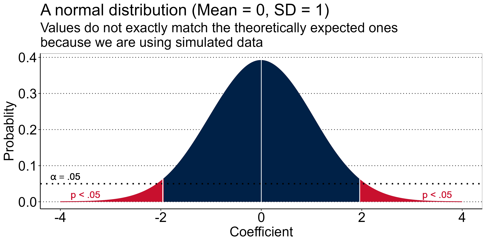

```

---
## Modelling: 3) Statistical inference

We can map the probability of our coefficient onto this distribution to find its **associated probability**

If the probability is lower than our **significance threshold** (e.g., $\alpha = .05$), we **reject the hypothesis** that the true value of the coefficient is 0!

We **interpret** the model goodness of fit, the coefficients, and draw (or do not draw) conclusions from them.

---
## Modelling: Assumptions!

We assume many things, one of the, being that observations are independent from each other.

This means that the **probability** of one observation taking one value is independent from the value other observations have taken.

```{r balls, echo=FALSE, message=FALSE, warning=FALSE, paged.print=FALSE, out.width="30%"}


```


---
class: section, center, middle

# Introducing random effects in our linear model

---
## What is a LMM

An extension of the GLM that allows to account for systematic sources of variability beyond our effects of interest.

All models are unnacurate to some degree.

Sometimes, part of the error the model makes is systematic.

---
## Why to use a LMM

* To **avoid aggregating data** (more statistical power)
* To account for **non-independence** of scores
* To account for **hierarchical structures** in our data
* To account for **cross-observational** unit variability

---
## Why to use a LMM

Effect of word frequency on reaction time task in a lexical decision task.

* Word condition:
- High frequency: **CAR** > Yes/No
- Low frequency: **FLAG** > Yes/No
* Non-word condition: **FOIR** > Yes/No

Does *frequency* affect *reaction times* (*RT*)?

---
## Why to use a LMM

```{r task, echo=FALSE, message=FALSE, warning=FALSE, paged.print=FALSE, out.width="100%"}

n_subj <- 5
n_trials <- 10
means <- c(0.1, 0.3, 0.55, 0.9, 1.5)


task_data <- tibble(
  participant = rep(paste0("Participant ", 1:n_subj), each = n_subj*2),
  trial = rep(1:n_trials, times = n_subj),
  freq = rep(c("High", "Low"), each = n_trials/2, times = n_subj),
  rt = c(
    rtruncnorm(n = 5, a = 0, b = Inf, mean = means[1], sd = 0.2),
    rtruncnorm(n = 5, a = 0, b = Inf, mean = means[1]+0.3, sd = 0.2),
    rtruncnorm(n = 5, a = 0, b = Inf, mean = means[2], sd = 0.2),
    rtruncnorm(n = 5, a = 0, b = Inf, mean = means[2]+0.7, sd = 0.2),
    rtruncnorm(n = 5, a = 0, b = Inf, mean = means[3], sd = 0.2),
    rtruncnorm(n = 5, a = 0, b = Inf, mean = means[3]+1, sd = 0.2),
    rtruncnorm(n = 5, a = 0, b = Inf, mean = means[4], sd = 0.2),
    rtruncnorm(n = 5, a = 0, b = Inf, mean = means[4]+1.5, sd = 0.2),
    rtruncnorm(n = 5, a = 0, b = Inf, mean = means[5], sd = 0.2),
    rtruncnorm(n = 5, a = 0, b = Inf, mean = means[5]+2, sd = 0.2)
  )
)

model <- lm(rt ~ freq, data = task_data)
model_agg <- lm(rt ~ freq, data = task_data %>% group_by(freq, participant) %>%summarise(rt = mean(rt)))
model_int <- lmer(rt ~ freq + (1 | participant), data = task_data)
model_slo <- lmer(rt ~ freq + (1 + freq|participant), data = task_data)
model_slo_no <- lmer(rt ~ freq + (0 + freq|participant), data = task_data)

task_plot_fix <- ggplot(task_data, aes(freq, rt)) +
  geom_jitter(alpha = 0.5, size = 3, width = 0.1) +
  stat_summary(aes(y = fitted(model)), fun = "mean", geom = "point", size = 4) +
  stat_summary(aes(group = 1), fun = "mean", geom = "line", size = 1) +
  geom_text(x = 1.5, y = 2, label = paste0("Intercept: ", round(model$coefficients[1], 2), "\nSlope: ", round(model$coefficients[2], 2))) +
  labs(x = "Frequency", y = "Reaction time (s)", colour = "Participant",
       subtitle = "No random effects") +
  theme(panel.grid = element_blank(),
        panel.grid.major.y = element_line(linetype = "dotted", colour = "grey10"),
        panel.background = element_rect(fill = "transparent"),
        text = element_text(size = 15, family = "Helvetica"),
        axis.line = element_line(colour = "black"),
        axis.text = element_text (colour = "black", family = "Helvetica"),
        legend.position = "right",
        legend.title = element_blank())

task_plot_points <- ggplot(task_data, aes(freq, rt, colour = participant)) +
  geom_jitter(alpha = 0.5, size = 3, width = 0.1) +
  labs(x = "Frequency", y = "Reaction time (s)", colour = "Participant",
       subtitle = "No random effects")


task_plot_fix_agg <- task_data %>%
  group_by(freq, participant) %>%
  summarise(rt = mean(rt), .groups = "drop") %>%
  ggplot(aes(freq, rt, colour = participant)) +
  geom_jitter(alpha = 0.5, size = 3, width = 0.1) +
  stat_summary(aes(group = 1), fun = "mean", geom = "line", size = 1, colour = "black") +
  stat_summary(aes(y = fitted(model_agg)), fun = "mean", geom = "point", size = 4, colour = "black") +
  geom_text(x = 1.5, y = 2, label = paste0("Intercept: ", round(model$coefficients[1], 2), "\nSlope: ", round(model$coefficients[2], 2)), colour = "black", show.legend = FALSE) +
  labs(x = "Frequency", y = "Reaction time (s)", colour = "Participant",
       subtitle = "No random effects, aggregated by participant") +
  theme(panel.grid = element_blank(),
        panel.grid.major.y = element_line(linetype = "dotted", colour = "grey10"),
        panel.background = element_rect(fill = "transparent"),
        text = element_text(size = 15, family = "Helvetica"),
        axis.line = element_line(colour = "black"),
        axis.text = element_text (colour = "black", family = "Helvetica"),
        legend.position = "right",
        legend.title = element_blank())

model_int_coefs <- data.frame(
  participant = paste0("participant", 1:5),
  x1 = 2.3,
  y1 = seq(1, 3, length.out = 5),
  intercept = round(coef(model_int)$participant[, 1], 2),
  slope = round(coef(model_int)$participant[, 2], 2)
)

task_plot_int <- ggplot(task_data, aes(freq, rt, colour = participant)) +
  geom_jitter(alpha = 0.5, size = 3, width = 0.1) +
  stat_summary(aes(y = fitted(model_int), group = participant), fun = "mean", geom = "point", size = 4) +
  stat_summary(aes(y = fitted(model_int), group = participant), fun = "mean", geom = "line", size = 1) +
  stat_summary(aes(y = fitted(model_int), group = 1), fun = "mean", geom = "point", size = 4) +
  stat_summary(aes(y = fitted(model_int), group = 1), fun = "mean", geom = "line", size = 1) +
  geom_label(x = 1.5, y = 3, colour = "black",
             label = paste0("Intercept: ", round(summary(model_int)$coefficients[1, 1], 2),
                            "\nCoefficient: ", round(summary(model_int)$coefficients[2, 1], 2)),
             show.legend = FALSE) +
  geom_text(data = model_int_coefs, aes(x = x1, y = y1, label = paste0("Intercept: ", intercept, "\nSlope: ", slope)),
            colour = "black", show.legend = FALSE, size = 3) +
  labs(x = "Frequency", y = "Reaction time (s)", colour = "Participant",
       subtitle = "Random intercepts by participant") +
  theme(panel.grid = element_blank(),
        panel.grid.major.y = element_line(linetype = "dotted", colour = "grey10"),
        panel.background = element_rect(fill = "transparent"),
        text = element_text(size = 15, family = "Helvetica"),
        axis.line = element_line(colour = "black"),
        axis.text = element_text (colour = "black", family = "Helvetica"),
        legend.position = "right",
        legend.title = element_blank())

model_slo_coefs <- data.frame(participant = paste0("participant", 1:5),
                              x1 = 2.3,
                              y1 = seq(1, 3.5, length.out = 5),
                              intercept = round(coef(model_slo)$participant[, 1], 2),
                              slope = round(coef(model_slo)$participant[, 2], 2))

task_plot_slo <- ggplot(task_data, aes(freq, rt, colour = participant)) +
  geom_jitter(alpha = 0.5, size = 3, width = 0.1) +
  stat_summary(aes(y = fitted(model_slo), group = participant), fun = "mean", geom = "point", size = 4) +
  stat_summary(aes(y = fitted(model_slo), group = participant), fun = "mean", geom = "line", size = 1) +
  stat_summary(aes(y = fitted(model_slo), group = 1), fun = "mean", geom = "point", size = 4) +
  stat_summary(aes(y = fitted(model_slo), group = 1), fun = "mean", geom = "line", size = 1) +
  geom_label(x = 1.5, y = 3, colour = "black",
             label = paste0("Intercept: ", round(summary(model_slo)$coefficients[1, 1], 2),
                            "\nCoefficient: ", round(summary(model_slo)$coefficients[2, 1], 2)),
             show.legend = FALSE) +
  geom_text(data = model_slo_coefs, aes(x = x1, y = y1, label = paste0("Intercept: ", intercept, "\nSlope: ", slope)), colour = "black", show.legend = FALSE, size = 3) +
  labs(x = "Frequency", y = "Reaction time (s)", colour = "Participant",
       subtitle = "Random intercepts by participant") +
  theme(panel.grid = element_blank(),
        panel.grid.major.y = element_line(linetype = "dotted", colour = "grey10"),
        panel.background = element_rect(fill = "transparent"),
        text = element_text(size = 15, family = "Helvetica"),
        axis.line = element_line(colour = "black"),
        axis.text = element_text (colour = "black", family = "Helvetica"),
        legend.position = "right",
        legend.title = element_blank())

ggsave(plot = task_plot_fix, here("img", "task_plot_fix.png"), height = 3, width = 7)
ggsave(plot = task_plot_points, here("img", "task_plot_fix_points.png"), height = 3, width = 7)
ggsave(plot = task_plot_fix_agg, here("img", "task_plot_fix_agg.png"), height = 3, width = 7)
ggsave(plot = task_plot_int, here("img", "task_plot_int.png"), height = 3, width = 7)
ggsave(plot = task_plot_slo, here("img", "task_plot_slo.png"), height = 3, width = 7)

```

Trial-wise data:

```{r task_table1, echo=FALSE, message=FALSE, warning=FALSE, paged.print=FALSE}
head(task_data, 10) %>%
  kable(format = "html", col.names = c("Participant", "Trial", "Frequency", "RT"), digits = 2, align = "c")

```

...

---
## Why to use a LMM

Data-points from all participants are pooled together:

```{r echo=FALSE, message=FALSE, warning=FALSE, paged.print=FALSE, outwidth="40%"}
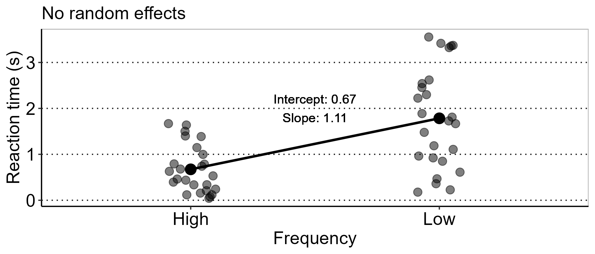
```

---
## Why to use a LMM

Assumption of non-indenpendence is had to assume here.

```{r echo=FALSE, message=FALSE, warning=FALSE, paged.print=FALSE, outwidth="40%"}

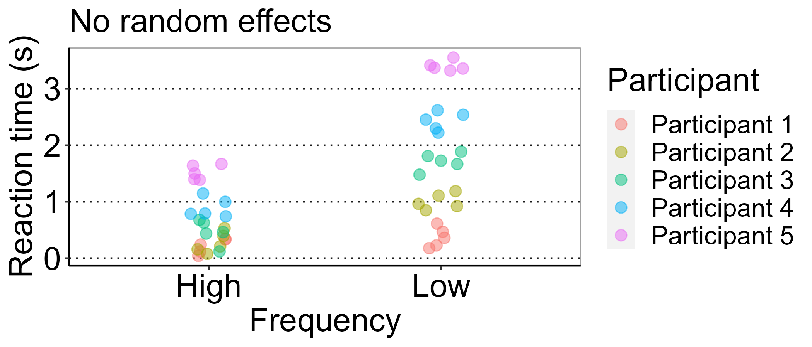

```

---
## Why to use a LMM

```{r task_table2, echo=FALSE, message=FALSE, warning=FALSE, paged.print=FALSE}
task_data %>%
  group_by(participant, freq) %>%
  summarise(rt = mean(rt)) %>%
  ungroup() %>%
  head(., 10) %>%
  kable(digits = 2, row.names = FALSE, col.names = c("Participant", "Condition", "RT (s)"), align = "c", format = "html")

```

---
## Why to use a LMM

```{r echo=FALSE, message=FALSE, warning=FALSE, paged.print=FALSE, outwidth="50%"}

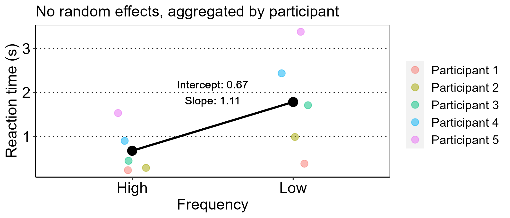

```

---
## Why to use a LMM

There is another way of dealing with no independence and *not* losing data.

```{r task_table, echo=FALSE, message=FALSE, warning=FALSE, paged.print=FALSE}
head(task_data, 10) %>%
  kable(digits = 2, row.names = FALSE, col.names = c("Participant", "Trial", "Condition", "RT (s)"), align = "c", format = "html")

```

---
## Why to use a LMM

```{r echo=FALSE, message=FALSE, warning=FALSE, paged.print=FALSE, outwidth="50%"}

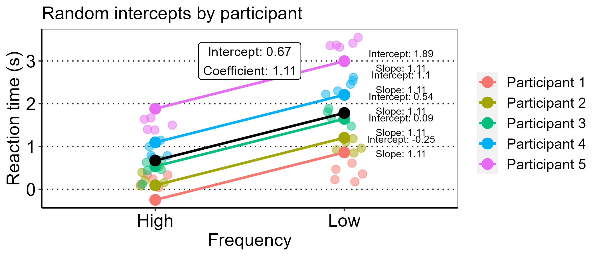

```

---
## Why to use a LMM

```{r echo=FALSE, message=FALSE, warning=FALSE, paged.print=FALSE, outwidth="70%"}

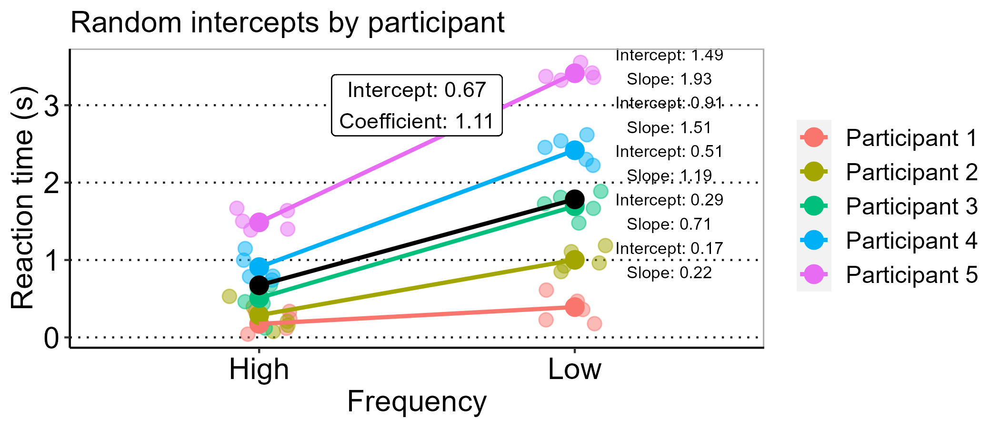

```


---
class: section, middle, center

# A real-life example

---
## How to use a LMM

Does previous experience with the Head-turn Preference Procedure (HPP) impact performance in the task?

.citation[
Santolin, C., García-Castro, G., Zettersten, M., Sebastian-Galles, N., & Saffran, J. (2020, March 4). Experience with research paradigms relates to infants' direction of preference. https://doi.org/10.31234/osf.io/xgvbh
]

You can find data and code here: https://osf.io/g95ub/

---
## How to use a LMM

An example using real data:

.citation[
Santolin, C., García-Castro, G., Zettersten, M., Sebastian-Galles, N., & Saffran, J. (2020, March 4). Experience with research paradigms relates to infants' direction of preference. https://doi.org/10.31234/osf.io/xgvbh
]

Does previous experience with the Head-turn Preference Procedure (HPP) impact performance in the task?

---
## The Head-turn Preference Procedure

Infants can't tell us whether they **discriminate** between stimuli.

Nor can they be instructed in an experimental task.

We use their **preferential looking** behaviour (how long infants turn their head towards the source of stimulation).

---
## The Head-turn Preference Procedure

1) We **familiarise** infants with one set of stimuli.

2) In each **test** trial, infants are presented with one token from the familiar set, or from the un familiar set. 

If infants **look systematically** longer to one set of stimuli than to others, it means that they are able to **discriminate** between them.

```{r echo=FALSE, message=FALSE, warning=FALSE, paged.print=FALSE, out.width="40%"}
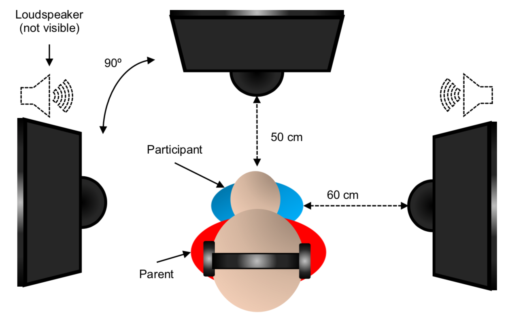
```

---
### The data

We gathered data from **6 experiments** run two different locations:

* Laboratori de Recerca en Infància (Universitat Pompeu Fabra, Barcelona)
* Waisman Center & Department of Psychology (University of Wisconsin-Madinson, Wisconsin)

All experiments were **broadly similar** in design, age of participants, and stimuli type.

---
### The data

However, there were some **differences**:

* Each experiment included different participants
* Participants lived in different countries (i.e., different cultures, lifestyle)
* Partcipants were exposed to different languages
* Participants had different language profile (monolinguals in Wisconsin, bilinguals in Barcelona)

---
### The data
```{r message=FALSE, warning=FALSE, include=FALSE, paged.print=FALSE}

flip_data <- read.csv(here("data", "flip_data.csv")) %>%
  select(Participant, Study, HPP, Item, LookingTime)

```

`flip_data <- read.csv("flip_data.csv")`

```{r echo=FALSE, message=FALSE, warning=FALSE, paged.print=FALSE}

flip_data %>%
  group_by(Study, HPP) %>%
  summarise(n = n()) %>%
  pivot_wider(names_from = HPP, values_from = n) %>%
  head() %>%
  kable(digits = 2, col.names = c("Study", "HPP 1th", "HPP 2nd", "HPP 3th", "HPP 4th", "HPP 5th", "HPP 6th"), align = "l")

```


---
### The data

Long vs. wide format data.

```{r echo=FALSE, message=FALSE, warning=FALSE, paged.print=FALSE}

flip_data %>%
  head() %>%
  kable(digits = 2, col.names = c("Participant", "Study", "HPP", "Item", "Looking Time (ms)"), align = "c")

```

---

```{r echo=FALSE, message=FALSE, warning=FALSE, paged.print=FALSE}

flip_data %>%
  mutate(Item = ifelse(Item==0, "Familiar", "Unfamiliar")) %>%
  pivot_wider(names_from = Item, values_from = LookingTime) %>%
  head() %>%
  kable(digits = 2, col.names = c("Participant", "Study", "HPP", "Familiar LT (ms)", "Novel LT (ms)"), align = "c")


```

???

Difference between wide and long format data

---
### Preparing our predictors

We use `Looking time` (in ms) as the **outcome**

We will use `Item` (familiar/novel) and number of previous `HPP` (numeric, 1-6) as predictors

We expect an `HPP` by `Item` **interaction**

> Previous experience with HPP should impact novel and familiar preference differently.


---
### Preparing our predictors

Coding variables: **dumy** vs. **effect** coding.

Model fitting functions like `lmer` don't care about how you call your **factor levels**.

It assigns a **numeric value** to each level.

In our case, *Familiar* = 0 and *Novel* = 1 (alphabetical order).


---
### Preparing our predictors

How you code your variables changes the **information** the model provides you.

This type of coding (0s and 1s) is named ***dumy coding***.

If *Familiar* =  0, and *Novel* = 1:

* **Model intercept**: Looking time when item is familiar.
* **Model slopes**: Change in looking time when item is novel.


---
### Preparing our predictors

We are interested in **interpreting changes in *novelty* preference**. Familiar trials should be the baseline.

The default coding happens to suit us.

But we should should always **explicitely recode our predictors** based on what information we want them to provide.

`flip <- mutate(flip_recorded, Item = ifelse(Item=="Familiar", 0, 1))`


---
### Preparing our predictors

Dummy coding `Item` makes sense because we have a **clear baseline**.

Alternatively, we could have *effect-coded* the predictor `Item`.

*Familiar* = -0.5, *Novel* = 0.5

In this case, the **intercept** (the looking time when `Item` = 0) would inform us about the **average looking time across conditions**.

How we have coded our variables impacts our conclusions especially when interpreting intercepts and main effects if we include interactions in our model.

.footer[We'll come back to this later.]

---
### Only fixed effects: Model fitting

**General Linear Model**:

$$Y = \beta_0 + \beta_1X_1 + \beta_2X_2 + ... + \beta_jX_j + \varepsilon$$

For participant $i$ and condition $j$

Fixed effects: 

$$LookingTime_{ij} = \beta_0 + \beta_1Item + \beta_2HPP + \beta_3Item \times HPP + \varepsilon_{ij}$$

---
### Only fixed effects: Model fitting

Implementing our model in R:

```
model_fixed <- lm(formula = LookingTime ~ Item*HPP, data = flip_data)
```

```{r message=FALSE, warning=FALSE, include=FALSE, paged.print=FALSE}

model_fixed <- lm(formula = LookingTime ~ Item*HPP,
                  data = flip_data)

```
---
### Only fixed effects: Statistical inference

Let's take a closer look at the estimates of the model:

```
summary_fixed <- summary(model_fixed)
summary_fixed$coefficients
```
```{r echo=FALSE}
summary_fixed <- summary(model_fixed)
summary_fixed$coefficients %>% 
  as.data.frame() %>%
  kable(digits = 3, col.names = c("Coefficient", "SE", "t", "p"), format = "html", align = "c")
```

---
### Only fixed effects: Model interpretation

```{r echo=FALSE, message=FALSE, warning=FALSE, paged.print=FALSE}

flip_plot_fixed <-  ggplot(data = flip_data, aes(x = Item, y = LookingTime)) +
  facet_wrap(~HPP, labeller = "label_both", nrow = 1) +
  stat_summary(aes(y = fitted(model_fixed)), fun = "mean", geom = "line", size = 1.5) +
  stat_summary(aes(y = fitted(model_fixed)), fun = "mean", geom = "point", size = 3) +
  labs(x = "HPP", y = "Looking Time (ms)", "Only fixed effects") +
  scale_x_continuous(breaks = 0:6) 


ggsave(here("img", "flip_fixed.png"), height = 3, width = 8)

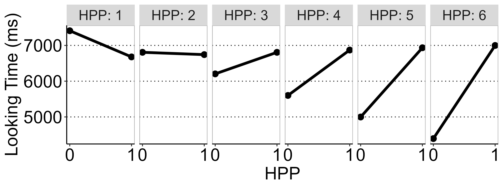

```

---
### Introducing random effects

Our data is **hierarchical**:

* Every participant provides two **data points**: one for familiar items and one for novel items.
* There are strong reasons to consider that **data points from the same participant are correlated**.

> Some infants are **long lookers**: high looking times in both conditions
> Some infants are **short lookers**: low looking times in both conditions

We should add **random intercepts** by participant.

---
### Random intercepts: Model especification

**Fixed effects**: 

Previously: $$LookingTime_{ij} = \beta_0 + \beta_1Item + \beta_2HPP + \beta_3Item \times HPP + \varepsilon_{ij}$$

**Fixed effects and random intercepts**:

$$LookingTime_{ij} = \beta_0 + P_{0i} + \beta_1Item + \beta_2HPP + \beta_3Item \times HPP + \varepsilon_{ij}$$

Where $P_{0i}$ is the intercept of participant $i$


---
### Random intercepts by participant: Model fitting

```{r echo=TRUE, message=FALSE, warning=FALSE, paged.print=FALSE}
library(lme4)
model_random <- lmer(formula = LookingTime ~ Item*HPP +
                       (1 | Participant), data = flip_data)

```

---
### Random intercepts by participant: Statistical inference

```{r echo=FALSE, message=FALSE, warning=FALSE, paged.print=FALSE}

summary_random <- summary(model_random)
summary_random$coefficients %>%
  as.data.frame() %>%
  kable(digits = 2, col.names = c("Coefficient", "SE", "t"), format = "html", align = "c")

```

Where are my ***p*-values**? I want my *p*-values :(

---
### Random intercepts: Statistical inference

Computing *p*-values in LMM is *not straightfoward*.

It's difficult to come map estimates into **probability distributions**.

Not clear how to pool parameters (many models have been run).

---
### Random intercepts by participant: Statistical inference

Several alternatives:

1) Assume estimated coefficients follow a **normal distribution**: map estandardised coefficients onto the normal distribution (*Mean* = 0, *SD* = 1) to get their probability.

2) Assume estimated coefficients follow a ***t*** or a ***F* distribution*** with *approximated* degrees of freedom:

* *t* distribution: **Satterthwaite**'s approximation to degrees of freedom
* $\chi^2$ distribution: **Wald**'s $\chi^2$ test
* *F* distribution: **Kenward-Roger** ANOVA

3) Shift to **Bayesian** statistical inference :)

---

```{r echo=FALSE, message=FALSE, warning=FALSE, paged.print=FALSE, out.width="40%"}
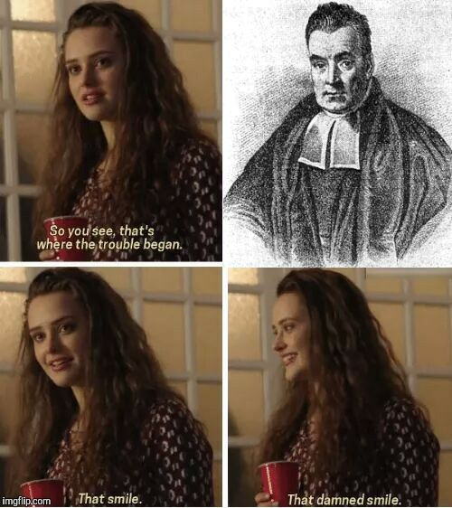
```

---
### Random intercepts by participant: Statistical inference

```
library(car)
Anova(model_random, type = "III", test.statistic = "F")
```
```{r echo=FALSE, message=FALSE, warning=FALSE, paged.print=FALSE}
library(car)
Anova(model_random, type = "III", test.statistic = "F") %>%
  as.data.frame() %>%
  kable(format = "html", digits = 3, col.names = c("F", "Df", "Df den.", "p"), align = "c")
```

---

### Random effects by participant: Model interpretation

```{r echo=FALSE, message=FALSE, warning=FALSE, paged.print=FALSE, out.width = "50%"}

flip_inter <- ggplot(data = flip_data, aes(x = Item, y = LookingTime, colour = Participant)) +
  facet_wrap(~HPP, labeller = "label_both", nrow = 1) +
  stat_summary(aes(y = fitted(model_random), group = Participant), fun = "mean", geom = "point", size = 2) +
  stat_summary(aes(y = fitted(model_random), group = Participant), fun = "mean", geom = "line", size = 1, alpha = 0.5) +
  stat_summary(aes(y = fitted(model_random), group = 1), fun = "mean", geom = "point", size = 3, colour = "black") +
  stat_summary(aes(y = fitted(model_random), group = 1), fun = "mean", geom = "line", size = 1.5, colour = "black") +
  labs(x = "Item", y = "Looking Time (ms)", "Only fixed effects") +
  scale_x_continuous(breaks = 0:6) +
  theme(panel.grid = element_blank(),
        panel.grid.major.y = element_line(linetype = "dotted", colour = "grey10"),
        panel.background = element_rect(fill = "transparent"),
        panel.border = element_rect(fill = "transparent", colour = "grey"),
        text = element_text(size = 20, family = "Helvetica"),
        axis.line = element_line(colour = "black"),
        axis.text = element_text (colour = "black", family = "Helvetica"),
        legend.position = "none")

ggsave(plot = flip_inter, here("img", "flip_inter.png"), height = 3, width = 7)

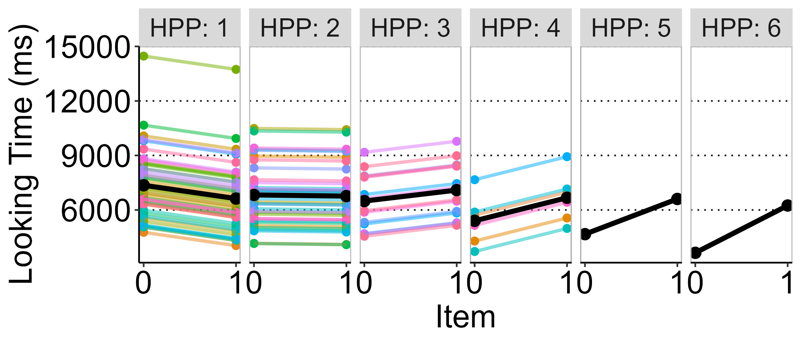

```

---
### Introducing random slopes

* There are also reasons to think that the **effect** of `Item` varies across infants.
* Long-lookers may be show **higher preferences** than others

> Some infants may discriminate better than others between familiar and novel items

The slope of `Item` may vary across infants.

---
### Random intercepts and item slopes by participants: Model especification

Previously: $$LookingTime_ij = \beta_0 + P_{0i} + \beta_1Item + \beta_2HPP + \beta_3Item \times HPP + \varepsilon_{ij}$$

Where $P_{0i}$ is the **intercept** of participant $i$

$$LookingTime_{ij} = \beta_0 + P_{0i} + (\beta_1 + P_{1i})Item+ \beta_2HPP + \beta_3Item \times HPP + \varepsilon_{ij}$$

Where $P_{1i}$ is the **slope** of `Item` for participant $i$

---
### Random intercepts and item slopes by participants: Model fitting

```{r echo=TRUE, message=FALSE, warning=TRUE, paged.print=FALSE, error=TRUE}

model_random_slopes <- lmer(formula = LookingTime ~ Item*HPP + (1 + Item*HPP | Participant),
                            data = flip_data)

```

Problem: there are a lot of parameters to estimate, and not enough variability.

May be related to some levels of HPP just having one participant.

Check this [link](https://stackoverflow.com/questions/19713228/lmer-error-grouping-factor-must-be-number-of-observations) out.

---
### Random intercepts and item slopes by participants: Model fitting

We can (somehow irresponsibly) force the model to go on.

```{r echo=TRUE, message=FALSE, warning=TRUE, paged.print=FALSE, error=TRUE}

model_random_slopes <- lmer(formula = LookingTime ~ Item*HPP + (1 + Item*HPP | Participant),
                            data = flip_data,
                            control = lmerControl(check.nobs.vs.nRE = "ignore"))

```

The model fails to converge (i.e., can't find the most likely coefficients given the data).


---

```{r echo=FALSE, message=FALSE, warning=FALSE, paged.print=FALSE, out.width="50%"}

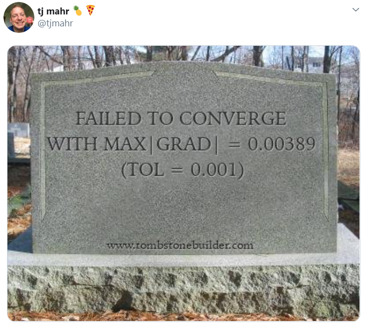

```

---
### Random intercepts and item slopes by participants: Model fitting

So, including `Item` random slopes by participant seems like a bad idea.

Let's stick to by-participants **random intercepts** only.

But haven't finished getting fancy!

---
### Adding a second random effect

Our data is missing an important source of **correlation between data points**: `Study`

Participants are more **similar within study** than between study.

We can account for this new source of variation by adding `Study` as a **random effect**.

---
### Random intercepts by participant and by study: Model especification

Fixed effects and random intercepts by participant:

Previously: $$LookingTime_ij = \beta_0 + P_{0i} + \beta_1Item + \beta_2HPP + \beta_3Item \times HPP + \varepsilon_{ij}$$

Where $P_{0i}$ is the **intercept** of participant $i$

$$LookingTime_{ij} = \beta_0 + P_{0i} + S_{0k} + \beta_1Item + \beta_2HPP + \beta_3Item \times HPP + \varepsilon_{ij}$$

Where $P_{0i}$ is the **intercept** of participant $i$ and $S_{0k}$ is the **intercept** of study $k$.

---
### Random intercepts and item slopes by participants and by study: Model fitting

```{r echo=TRUE, message=FALSE, warning=TRUE, paged.print=FALSE}

model_random_intercepts2 <- lmer(formula = LookingTime ~ Item*HPP + (1 | Participant) + (1 | Study),
                                 data = flip_data)

```

---
### Random intercepts by participant and by study: Statistical inference

```{r echo=FALSE, message=FALSE, warning=FALSE, paged.print=FALSE}

Anova(model_random_intercepts2, type = "III", test.statistic = "F") %>%
  as.data.frame() %>%
  kable(format = "html", digits = 3, col.names = c("F", "Df", "Df den.", "p"), align = "c")

```

---
### Random intercepts by participant and by study: Model interpretation

```{r echo=FALSE, message=FALSE, warning=FALSE, paged.print=FALSE, out.width = "50%"}

flip_slope <- flip_data %>%
  mutate(Study = as.numeric(as.factor(Study))) %>%
  ggplot(aes(x = Item, y = LookingTime, colour = Participant)) +
  facet_grid(Study~HPP, labeller = "label_both") +
  stat_summary(aes(y = fitted(model_random_intercepts2), group = Participant), fun = "mean", geom = "point", size = 2) +
  stat_summary(aes(y = fitted(model_random_intercepts2), group = Participant), fun = "mean", geom = "line", size = 1, alpha = 0.5) +
  stat_summary(aes(y = fitted(model_random_intercepts2), group = 1), fun = "mean", geom = "point", size = 3, colour = "black") +
  stat_summary(aes(y = fitted(model_random_intercepts2), group = 1), fun = "mean", geom = "line", size = 1.5, colour = "black") +
  labs(x = "Item", y = "Looking Time (ms)") +
  scale_x_continuous(breaks = 0:6) +
  theme(panel.grid = element_blank(),
        panel.grid.major.y = element_line(linetype = "dotted", colour = "grey10"),
        panel.background = element_rect(fill = "transparent"),
        panel.border = element_rect(fill = "transparent", colour = "grey"),
        text = element_text(size = 20, family = "Helvetica"),
        axis.line = element_line(colour = "black"),
        axis.text = element_text (colour = "black", family = "Helvetica"),
        legend.position = "none")

ggsave(plot = flip_slope, here("img", "flip_slopes.png"), height = 5, width = 7)

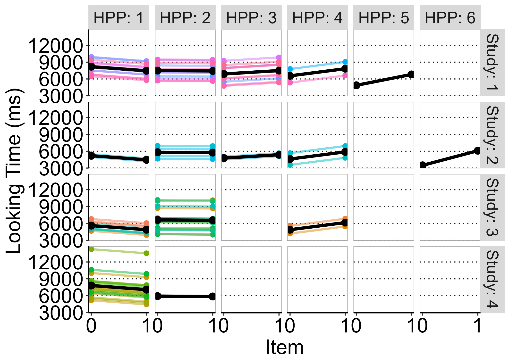

```

---
### Introducing random slopes by study

Finally, we can also expect the effect of `HPP` to vary **across studies**.

Infants in some studies could have been **more sensitive** to the effect of previous experience with HPP.

---
### Random intercepts by participant and study, and random `Item` slopes by study: Model especification

Previously: $$LookingTime_ij = \beta_0 + P_{0i} + S_{0k} + \beta_1Item + \beta_2HPP + \beta_3Item \times HPP + \varepsilon_{ij}$$

Where $P_{0i}$ is the **intercept** of participant $i$ and $S_{0k}$ is the **intercept** of study $k$.

$$LookingTime_{ij} = \beta_0 + P_{0i} + (\beta_1 + S_{1k})Item+ \beta_2HPP + \beta_3Item \times HPP + \varepsilon_{ij}$$

Where $P_{0i}$ is the **intercept** of participant $i$, $S_{0k}$ is the **intercept** of study $k$, and $S_{1k}$ is the **slope** of `Item` on study `k`.

---
### Random intercepts by participant and study, and random `HPP` slopes by study: Model fitting

```{r echo=TRUE, message=FALSE, warning=TRUE, paged.print=FALSE}

model_random_slope2 <- lmer(formula = LookingTime ~ Item*HPP + (1 | Participant) + (1 + HPP | Study),
                            data = flip_data)
```

---
### Random intercepts by participant and study, and random `Item` slopes by study: Statistical inference

```{r echo=FALSE, message=FALSE, warning=FALSE, paged.print=FALSE}
Anova(model_random_slope2, type = "III", test.statistic = "F") %>%
  as.data.frame() %>%
  kable(format = "html", digits = 3, col.names = c("F", "Df", "Df den.", "p"))
```


---
### Random intercepts by participant and study, and random `Item` slopes by study: Model interpretation

```{r echo=FALSE, message=FALSE, warning=FALSE, paged.print=FALSE}


flip_slope2 <- flip_data %>%
  mutate(Study = as.numeric(as.factor(Study))) %>%
  ggplot(aes(x = Item, y = LookingTime, colour = Participant)) +
  facet_grid(Study~HPP, labeller = "label_both") +
  stat_summary(aes(y = fitted(model_random_slope2), group = Participant), fun = "mean", geom = "point", size = 2) +
  stat_summary(aes(y = fitted(model_random_slope2), group = Participant), fun = "mean", geom = "line", size = 1, alpha = 0.5) +
  stat_summary(aes(y = fitted(model_random_slope2), group = 1), fun = "mean", geom = "point", size = 3, colour = "black") +
  stat_summary(aes(y = fitted(model_random_slope2), group = 1), fun = "mean", geom = "line", size = 1.5, colour = "black") +
  labs(x = "HPP", y = "Looking Time (ms)") +
  scale_x_continuous(breaks = 0:6) +
  theme(panel.grid = element_blank(),
        panel.grid.major.y = element_line(linetype = "dotted", colour = "grey10"),
        panel.background = element_rect(fill = "transparent"),
        panel.border = element_rect(fill = "transparent", colour = "grey"),
        text = element_text(size = 20, family = "Helvetica"),
        axis.line = element_line(colour = "black"),
        axis.text = element_text (colour = "black", family = "Helvetica"),
        legend.position = "none")

ggsave(plot = flip_slope2, here("flip_slopes2.png"), height = 5.5, width = 7)

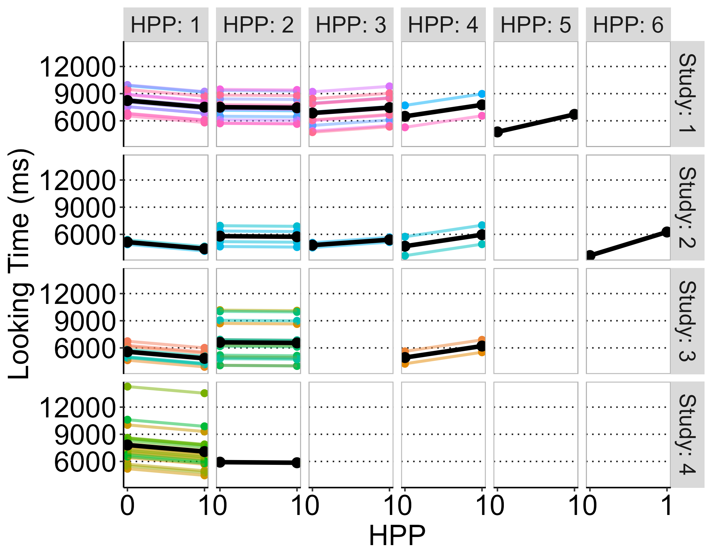

```

---
### Random intercepts by participant and study, and random `Item` slopes by study: Model interpretation

However, we missed something in the `lmer` output...

```{r echo=FALSE, message=FALSE, warning=FALSE, paged.print=FALSE, out.width="50%"}

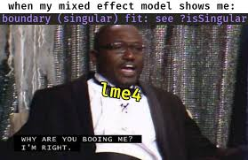

```

---
### Random intercepts by participant and study, and random `HPP` slopes by study: Model interpretation

Our fit is singular! But what does this mean? It has to do with something we haven't talked about yet.

Random intercepts and slopes are not the only different thing about LMMs.

There is an additional parameter we haven't talked about yet:

[*Dark deep voice*]: The **correlation** parameter, $\rho$.

---
### (Parenthesis: Introducing the correlation parameter)

LMMs allow intercepts to vary across observational units.

> Each participant has her own intercept

The amount of **variation across intercepts** impacts how fixed effects are estimated, and how we perform inferences from them.

The intercept **standard deviation**, $\sigma$ reflects this variability.

Same goes for **random slopes**.


---
### (Parenthesis: Introducing the correlation parameter)

For each random effect (i.e., study), random intercepts and slopes may vary together:

They may be **correlated**.

> Participants that were **slower** in our lexical decission task may be **more sensitive** to the frequency manipulation.

---
```{r echo=FALSE, message=FALSE, warning=FALSE, paged.print=FALSE, outwidth="70%"}


```


---
### (Parenthesis: Introducing the correlation parameter)

> Studies where participants looked longer on average may be those where participants discriminated better between familiar and novel trials.

```{r echo=FALSE, message=FALSE, warning=FALSE, paged.print=FALSE, out.width="50%"}

```

---
### (Parenthesis: Introducing the correlation parameter)

Together with $\sigma$, $\rho$ is calculated for a given random effect, both intercepts and slopes are especified.

These parameters are accessible from the `lmer` output, in the for of a matrix:

```{r echo=FALSE, message=FALSE, warning=FALSE, paged.print=FALSE}
s <- summary(model_random_slope2)
s$varcor %>%
  as.data.frame() %>%
  kable(digits = 2, format = "html", col.names = c("Term", "SD1", "SD2", "Cov.", "Correlation"))
```

---
### (Parenthesis: Introducing the correlation parameter)

The **variance-covariance matrix** is **singular**.

Correlation parameter is near 1 and/or SD are close to 0.

Our model is **overparameterised**.

We should be asking a bit less from the data.

We should make our model more **parsimonious** (Bates et al., 2015).

**Simplify** the random effects structure.

More about failure to converge and singular fit later...

---
### Our final model:

Includes:

* Main effects of `Item` and `HPP`
* `Item` $\times$ `HPP` interaction
* Crossed random effects for participants and study (in contrast to nested random effects; more about this later)
- Random by-participant intercepts
- Random by-study intercepts

---
### Our final model:

Accounts for:

* The **fixed effect** of `Item` on looking times.
* The **fixed effect** of `HPP` on looking times.
* The **differential effect** of `HPP` on each test `Item` (interaction).
* **Cross-participant variability** in overall looking time.
* **Cross-study variability** in overall looking time.
* **Hierarchical structure** of our data

---
### Our final model:

```{r echo=FALSE, message=FALSE, warning=FALSE, paged.print=FALSE}
Anova(model_random, type = "III", test.statistic = "F") %>%
  as.data.frame() %>%
  kable(format = "html", digits = 3, colnames = c("F", "Df", "Df den.", "p"))
```


---
### Random intercepts by participant: Statistical inference

```{r echo=FALSE, message=FALSE, warning=FALSE, paged.print=FALSE, out.width="50%"}

library(ggeffects)
library(patchwork)

coefs <- summary(model_random) %$% 
  coefficients %>%
  as.data.frame() %>%
  rownames_to_column("Term") %>%
  mutate(term = c("(Intercept)", "Item", "HPP", "Item:HPP")) %>% 
  select(., Term = term, Coefficient = Estimate, SEM = `Std. Error`)

confints <- confint.merMod( # calculate confidence intervals
  model_random,  
  method = "boot",
  level = 0.95
) %>%
  as.data.frame() %>%
  rownames_to_column(var = "Term") %>% 
  slice(3:6) %>%
  mutate(Term = c("(Intercept)", "Item", "HPP", "Item:HPP"))

anova <- Anova(model_random, type = "III", test.statistic = "F") %>% # perform type III ANOVA (KF F-test)
  as.data.frame() %>%
  rownames_to_column("Term") %>%
  right_join(., coefs, by = "Term") %>% # join outcome with coefficients
  left_join(., confints, by = "Term") %>% # join outcome with confidence intervals
  mutate(ci1 = round(`2.5 %`, 1),
         ci2 = round(`97.5 %`, 1)) %>%
  unite(col = "CI95", ci1, ci2, sep = ", ") %>% # make a string with the lower and upper CI
  mutate(CI95 = paste0("[", CI95, "]")) %>%
  rename(ci1 = `2.5 %`,
         ci2 = `97.5 %`,
         p = `Pr(>F)`) %>%
  select(Term, `F`, Df, Df.res, Coefficient, SEM, ci1, ci2, CI95, Coefficient, Df.res, p)

effects <- ggpredict(model_random, terms = c("HPP", "Item")) %>%
  rename(Item = group, HPP = x) %>%
  mutate(Item = ifelse(Item==0, "Familiar", "Novel"))

flip_coefs <- anova %>% 
  filter(., Term != "(Intercept)") %>%
  mutate(Term = case_when(Term == "Item" ~ "Item",
                          Term=="HPP" ~ "HPP",
                          Term=="Item:HPP" ~ "Item \U000D7 HPP",
                          TRUE ~ "")) %>%
  ggplot(data = ., aes(Term, Coefficient)) +
  geom_linerange(aes(x = Term, ymin = ci1, ymax = ci2), alpha = 0.5, size = 10) +
  geom_point(size = 3, colour = "black") +
  geom_errorbar(aes(ymax = Coefficient+SEM, ymin = Coefficient-SEM), size = 1.5, width = 0, colour = "black") +
  geom_hline(yintercept = 0) +
  labs(x = "Term", y = "Coefficient\n") +
  coord_flip() +
  theme(
    panel.grid.major.x = element_line(colour = "grey", linetype = "dotted"),
    panel.grid.minor.x = element_line(colour = "grey", linetype = "dotted"),
    panel.grid.major.y = element_blank(),
    panel.grid.minor.y = element_blank(),
    panel.background   = element_rect(fill = "white", colour = "grey"),
    text               = element_text(colour = "black", size = 20),
    axis.text          = element_text(colour = "black"),
    axis.title.y       = element_blank(),
    axis.title.x       = element_text(size = 15), 
    axis.ticks.y       = element_blank(),
    legend.position    = "none"
  ) +
  # plot predictions
  ggplot(effects, aes(x = HPP, y = predicted, shape = Item, fill = Item)) +
  geom_ribbon(aes(x = HPP, ymin = conf.low, ymax = conf.high), colour = NA, alpha = 0.5) +
  geom_line(size = 0.75) +
  geom_point(size = 3) +
  labs(x = "HPP visits",
       y = "Looking time (ms)\n",
       colour = "Test item",
       fill = "Test item",
       shape = "Test item") +
  scale_fill_grey(start = 0.25, end = 0.75) +
  scale_x_continuous(breaks = seq(1, 6, by = 1)) +
  theme(panel.grid = element_blank(),
        panel.grid.major.y = element_line(linetype = "dotted", colour = "grey10"),
        panel.background = element_rect(fill = "transparent"),
        panel.border = element_rect(fill = "transparent", colour = "grey"),
        text = element_text(size = 20, family = "Helvetica"),
        axis.line = element_line(colour = "black"),
        axis.title = element_text(size = 15), 
        legend.title = element_blank(),
        legend.text = element_text(size = 10),
        legend.position    = c(0.3, 0.05),
        axis.text = element_text (colour = "black", family = "Helvetica"),
        legend.direction = "horizontal",
        legend.background = element_rect(fill = "transparent")
  ) +
  plot_layout(nrow = 1, guides = "keep", tag_level = "new") +
  plot_annotation(tag_levels = "A")

ggsave(plot = flip_coefs, here("img", "flip_coefs.png"), height = 5, width = 7)

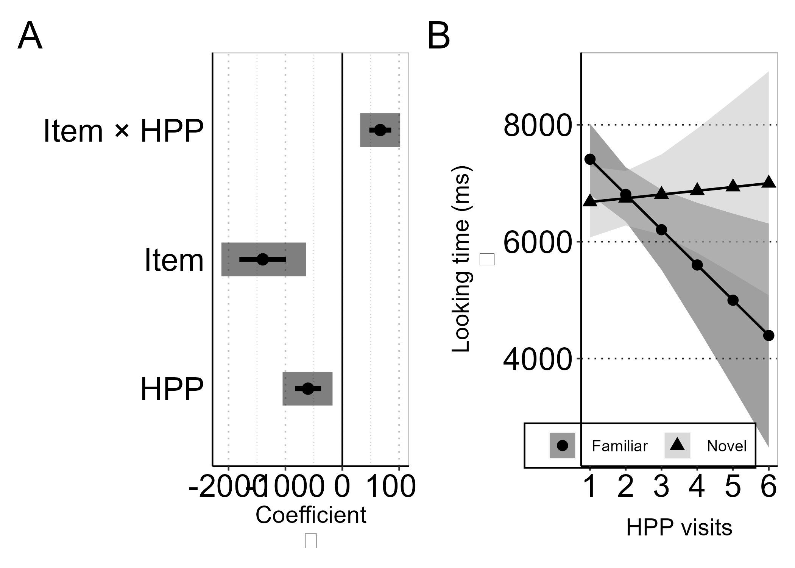
```

---
class: section, center, middle

# Some additional points

---
## Power analysis in Mixed Models

LMM involved the estimation of many parameters.

To perform power analysis, we need to fix some of these parameters

It's difficult to come up with **sensible parameters** *a priori*

* How much variability am I expecting for each random effect?
* How much correlation am I expecting between random efects?

---
## Power analysis in Mixed Models

Also, estimating power analytically (mapping expected parameters onto known distributions) is not straightforward in LMM.

It's not quite clear what parameters we are referring to.

Alternative: shift to simulation-based power analysis. Already available for non-mixed models (e.g., ANOVA). See Lakens and Caldwell ([2019](https://psyarxiv.com/baxsf/)) and it's accompanying R package, `ANOVApower`.

Some methods are already available for mixed-models:

* Zhang and Wang ([2009](https://link.springer.com/article/10.3758/BRM.41.4.1083)): Includes non-linear models, but it's implemented in commercial software (SAS)
* DeBruine and Barr (2019)

---
## When our model fails to converge

Sometimes, our model can't figure out **what parameters are most likely** given the data.

This can be because **different values** of the same coefficient are **equally likely**.

How to avoid this:

* The **larger** the data, the easier to converge.
* The larger values of the coefficients the more difficult to converge. Consider:
- Changing units of measurement: use **seconds** instead of milliseconds (Barr, 2008).
- **Standardising** your predictors.
* Don't get too fancy with your model: the more **parsimonious**, the better (less parameters to estimate).

---
## When our model is overly complex: singular fit

See Bates et al. (2015)
